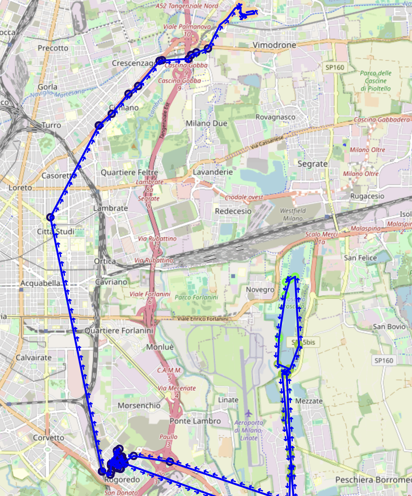

# GPS Route Mapping with Folium

This project visualizes GPS data using a web-based interactive map. It leverages the `folium` library to display GPS points, draw routes, and indicate movement direction with arrows.


## How to create a Basic Map


1. **Map Creation**:
   ```python
   m = folium.Map(location=[routine_df['lat'].mean(), routine_df['lon'].mean()], zoom_start=12)
   ```
   - **Purpose**: Initializes a `folium` map centered at the average latitude and longitude of the data points.
   - **Method**: Uses the mean of latitude (`lat`) and longitude (`lon`) columns to center the map.
